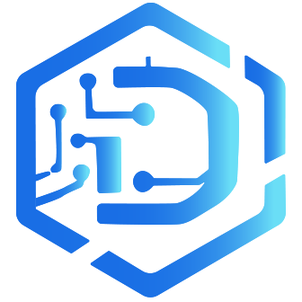

# Darwin Platform

[](https://dotnet.microsoft.com/)
[](https://learn.microsoft.com/ef/)
[](https://learn.microsoft.com/dotnet/csharp/)
[](https://react.dev/)
[](https://nextjs.org/)
[](https://htmx.org/)
[](https://learn.microsoft.com/dotnet/maui/)

Darwin is a multi-tenant-ready commerce and operations platform for small and medium businesses. It combines CMS, commerce, CRM, loyalty, inventory/procurement, billing/accounting, WebAdmin, WebApi, Worker, a Next.js front-office, and MAUI mobile apps.

For the full documentation index, start with [docs/README.md](docs/README.md). It identifies the authoritative document for each topic and explains where future updates belong.

## Current Focus

The current execution focus is `Darwin.WebAdmin` as the operational control center for business onboarding, setup, support, inventory, billing, communication, and provider readiness. `Darwin.Mobile.Business` is strategically important for early operational use, so WebAdmin, WebApi, authentication, and onboarding flows must stay aligned with it.

Near-term delivery order:

1. Complete and keep stable the WebAdmin operational workflows.
2. Keep business onboarding, identity, account activation, invitations, setup, and support flows usable for real SMEs.
3. Keep mobile-used WebApi contracts stable.
4. Continue front-office expansion after the operational core stays green.

## Architecture Summary

```text
src/
|-- Darwin.Domain          - Entities, value objects, enums, and aggregate rules
|-- Darwin.Application     - Use cases, handlers, DTOs, validators, and orchestration
|-- Darwin.Infrastructure  - Shared EF Core model, DbContext, seed pipeline, and infrastructure services
|-- Darwin.Infrastructure.PostgreSql - PostgreSQL provider registration and migrations
|-- Darwin.Infrastructure.SqlServer  - SQL Server provider registration and migrations
|-- Darwin.Infrastructure.PersistenceProviders - Runtime persistence provider selection
|-- Darwin.WebAdmin        - ASP.NET Core MVC/Razor + HTMX back-office
|-- Darwin.WebApi          - REST API for public, member, business, admin, and provider callbacks
|-- Darwin.Web             - Next.js React storefront and member portal
|-- Darwin.Worker          - Background jobs and schedulers
|-- Darwin.Shared          - Shared results, constants, and helpers
|-- Darwin.Contracts       - Shared API contracts for WebApi and mobile
|-- Darwin.Mobile.Shared   - Shared mobile services and API clients
|-- Darwin.Mobile.Consumer - Consumer-facing MAUI app
`-- Darwin.Mobile.Business - Business-facing MAUI app
```

Important boundaries:

- `Darwin.WebAdmin` builds with the .NET solution and remains the operational priority.
- `Darwin.Web` is managed by Node/npm and must stay customer-facing. Internal diagnostics, readiness dashboards, review queues, and back-office wording do not belong in public UI.
- `Darwin.WebApi` is the delivery boundary for storefront, member, mobile, and future external consumers.
- `Darwin.Contracts` is the contract boundary. Admin DTOs must not leak into public/member contracts.
- Domain and Application stay provider-agnostic. Provider SDK references belong in Infrastructure/provider-specific infrastructure only.

## Provider Strategy

- Persistence: PostgreSQL is the preferred/default provider. SQL Server remains supported. See [docs/persistence-providers.md](docs/persistence-providers.md).
- Payments: Stripe is the phase-1 payment provider. Browser return routes must not finalize payment; verified webhooks remain authoritative. See [DarwinWebApi.md](DarwinWebApi.md) and [docs/go-live-status.md](docs/go-live-status.md).
- Shipping: DHL is the phase-1 shipping provider. Live account smoke remains a production blocker. See [docs/production-setup.md](docs/production-setup.md).
- Object storage: MinIO is the recommended self-hosted production target through the S3-compatible provider. AWS S3 and Azure Blob are supported alternatives. Database/internal archive storage is development/internal fallback only. Production immutability requires provider-level Object Lock/versioning/retention/legal-hold validation. See [docs/archive-storage-provider-decision.md](docs/archive-storage-provider-decision.md) and [docs/minio-storage-runbook.md](docs/minio-storage-runbook.md).
- E-invoice: ZUGFeRD/Factur-X generation is not complete. Mustangproject CLI is the selected first tooling path; XRechnung is later backlog. See [docs/e-invoice-tooling-decision.md](docs/e-invoice-tooling-decision.md).

## Status Snapshot

Current code-backed status belongs in [docs/go-live-status.md](docs/go-live-status.md) and [docs/module-audit.md](docs/module-audit.md). Active roadmap items belong in [BACKLOG.md](BACKLOG.md).

| Pillar | Snapshot |
| --- | --- |
| WebAdmin | Highest priority; core operator workflows, hosted smoke coverage, and secret-free provider readiness surfaces exist. |
| WebApi | Active delivery boundary for public/member/business/admin routes and provider callbacks. |
| Web | Real storefront/member shell exists, but remains secondary to the WebAdmin operational lane. |
| Mobile | Consumer and Business apps are active and conditionally usable for implemented workflows; store launch still depends on secure mobile configuration, release packaging/signing, provider/device smoke, and remaining checkout/subscription scope decisions. |
| Persistence | PostgreSQL preferred/default; SQL Server supported. |
| Object storage | Architecture implemented; local MinIO smoke passed; production Object Lock/retention validation remains deployment-specific. |
| External providers | Stripe, DHL, Brevo, VIES still require provider/account smoke or production verification before go-live claims. |
| Compliance/e-invoice | Policy and groundwork exist; legal compliance is not claimed for e-invoice or archive immutability until real provider/tooling validation is complete. |

## Getting Started

Prerequisites:

- .NET 10 SDK
- Node.js 24.x for `src/Darwin.Web`
- Docker Desktop for local PostgreSQL, SQL Server, and optional MinIO smoke
- Visual Studio 2026 or equivalent tooling for MAUI/mobile work

Useful commands:

```powershell
dotnet restore Darwin.sln
dotnet build src/Darwin.WebAdmin/Darwin.WebAdmin.csproj
dotnet build src/Darwin.WebApi/Darwin.WebApi.csproj

docker compose up -d
dotnet run --project src/Darwin.WebAdmin -c Debug --launch-profile "https"
dotnet run --project src/Darwin.WebApi -c Debug --launch-profile "https"
```

For the front-office:

```powershell
cd src/Darwin.Web
npm install
npm run dev
```

For optional local MinIO smoke, use [docs/minio-storage-runbook.md](docs/minio-storage-runbook.md).

## Focused Documents

- [docs/README.md](docs/README.md): full documentation map and source-of-truth matrix.
- [BACKLOG.md](BACKLOG.md): active roadmap and go-live blockers.
- [DarwinDomainDesign.md](DarwinDomainDesign.md): domain model and cross-module rules.
- [DarwinWebAdmin.md](DarwinWebAdmin.md): back-office operating model, HTMX conventions, and admin workflow guidance.
- [DarwinFrontEnd.md](DarwinFrontEnd.md): Next.js storefront/member portal boundaries.
- [DarwinMobile.md](DarwinMobile.md): MAUI app responsibilities and backend dependencies.
- [DarwinWebApi.md](DarwinWebApi.md): route roots, API audiences, DTO boundaries, and webhook-authoritative payment completion.
- [DarwinTesting.md](DarwinTesting.md): testing strategy, lanes, commands, and current priority coverage.
- [docs/production-setup.md](docs/production-setup.md): production deployment runbook and smoke order.
- [docs/external-smoke-inputs.md](docs/external-smoke-inputs.md): external smoke environment variable names and commands.
- [CONTRIBUTING.md](CONTRIBUTING.md): engineering rules and contribution standards.
